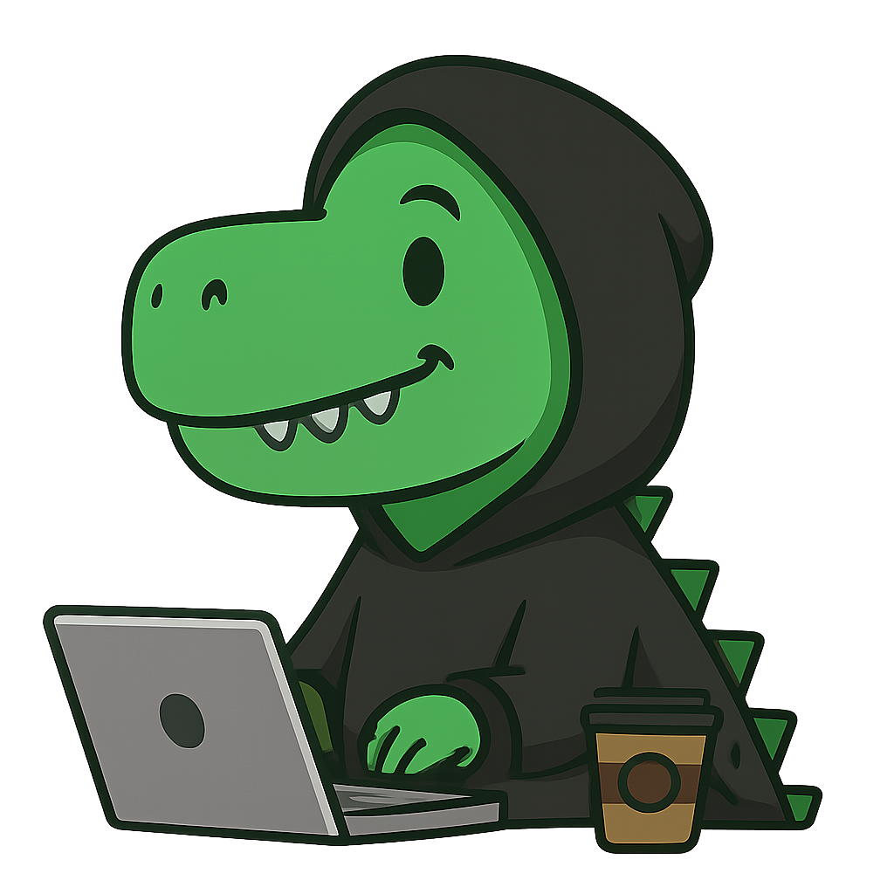

  

 

  

 

Lorem ipsum dolor sit amet, consectetur adipiscing elit. Maecenas nec est quis mauris pretium ornare eu eget nunc. Nulla nec vestibulum elit. Praesent rhoncus arcu nec commodo rhoncus. Praesent sollicitudin eleifend ex, vel molestie ligula. Aliquam erat volutpat. Interdum et malesuada fames ac ante ipsum primis in faucibus. Etiam fermentum risus nisl. Pellentesque non maximus neque. Aliquam erat volutpat. Maecenas sed mauris est. Curabitur tincidunt eros sed finibus cursus. Suspendisse at orci vitae ligula pulvinar aliquam. 

 

 

- Frontend Developer
- Always learning and exploring new tech
- Tech Stack: Angular, React, TypeScript, SCSS
- I find rhythm in chaos with my headphones on.
- I don’t have all the answers, but I’m always trying to improve.

 

